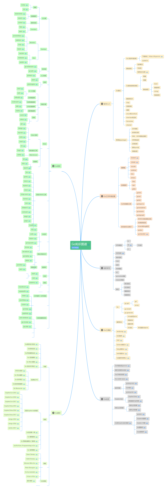

# Golang-talk
Golang 简单谈谈/学习笔记/使用心得（cong ru men dao fang qi）

### Go 说说Protobuf的使用
[说说Protobuf的使用](https://github.com/kevin2018pg/golang-notes/blob/master/Go-ProtocolBuffers%E4%BD%BF%E7%94%A8.md)

### Go 工作填坑slice/map并发安全
[工作爬坑之slice/map并发安全](https://github.com/kevin2018pg/golang-notes/blob/master/Go-slice%26map%E5%B9%B6%E5%8F%91%E5%AE%89%E5%85%A8.md)

### Go 令人头晕的WaitGroup+channel+context协程同步
[令人头晕的WaitGroup+channel+context协程同步](https://github.com/kevin2018pg/golang-notes/blob/master/Go-WaitGroup%26channel%26context%E5%B9%B6%E5%8F%91.md)

### Go 深入理解排序接口
[深入理解排序接口](https://github.com/kevin2018pg/golang-talk/blob/master/Go-%E6%B7%B1%E5%85%A5%E7%90%86%E8%A7%A3%E6%8E%92%E5%BA%8F%E6%8E%A5%E5%8F%A3.md)

附上

